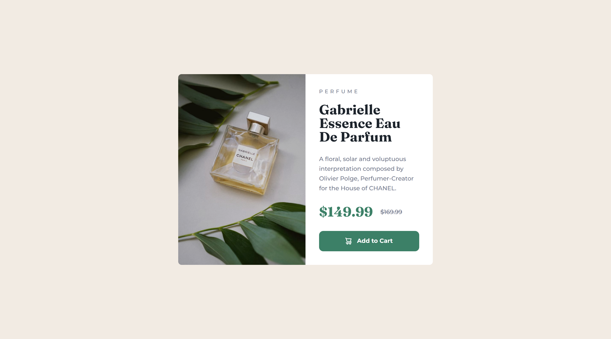

# Frontend Mentor - Product preview card component solution

This is a solution to the [Product preview card component challenge on Frontend Mentor](https://www.frontendmentor.io/challenges/product-preview-card-component-GO7UmttRfa). Frontend Mentor challenges help you improve your coding skills by building realistic projects.

## Table of contents

- [Overview](#overview)
  - [The challenge](#the-challenge)
  - [Screenshot](#screenshot)
  - [Links](#links)
- [My process](#my-process)
  - [Built with](#built-with)
  - [What I learned](#what-i-learned)
  - [Continued development](#continued-development)
  - [Useful resources](#useful-resources)
- [Author](#author)
- [Acknowledgments](#acknowledgments)

**Note: Delete this note and update the table of contents based on what sections you keep.**

## Overview

### The challenge

Users should be able to:

- View the optimal layout depending on their device's screen size
- See hover and focus states for interactive elements

### Screenshot

### Links

- Solution URL: [Url](https://my-solution-url.com)
- Live Site URL: [Product prieview card](https://jomagene.github.io/product-prieview-page/)

## My process

### Built with

- Semantic HTML5 markup
- CSS custom properties
- Flexbox
- Mobile-first workflow
- Sass

### What I learned

In this project, I learned how to create a background blur effect using the ::before pseudo-element, which added a subtle, transparent overlay to images. I also mastered the use of variables in SCSS, making my stylesheets more maintainable and consistent. Additionally, I learned the importance of using relative units like rem and em for better accessibility, ensuring the design adapts well to different devices and user settings.

### Continued development

Moving forward, I want to explore CSS Grid for complex layouts and delve deeper into SCSS to optimize my styling workflow. I also aim to improve my understanding of accessibility best practices.

Sure! Here's a more concise version:

### What I Learned

In this project, I learned how to create a background blur effect using the `::before` pseudo-element, which added a subtle, transparent overlay to images. I also mastered the use of variables in SCSS, making my stylesheets more maintainable and consistent. Additionally, I learned the importance of using relative units like `rem` and `em` for better accessibility, ensuring the design adapts well to different devices and user settings.

### Continued Development

Moving forward, I want to explore CSS Grid for complex layouts and delve deeper into SCSS to optimize my styling workflow. I also aim to improve my understanding of accessibility best practices.

### Useful Resources

- [CSS Tricks - Pseudo-elements](https://css-tricks.com/almanac/selectors/a/after-and-before/) - Helped me effectively use `::before` and `::after` in CSS.
- [SCSS Variables](https://sass-lang.com/guide) - The Sass guide was essential in learning to use variables for maintainable styles.

### Author

- Frontend Mentor - [@Jomagene](https://www.frontendmentor.io/profile/Jomagene)
- GitHub - [@Jomagene](https://github.com/Jomagene)

### Acknowledgments

Thanks to [Frontend Mentor](https://www.frontendmentor.io) for the challenge and the learning opportunity!
